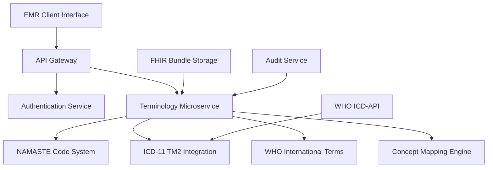

# NAMASTE-ICD-11 TM2 Integration API: Comprehensive Technical Documentation

## Executive Summary

This document provides comprehensive technical specifications for developing a FHIR R4-compliant terminology microservice that integrates India's NAMASTE codes with WHO ICD-11 Traditional Medicine Module 2 (TM2) and Biomedicine classifications. The solution enables dual-coding capabilities for traditional medicine EMR systems while maintaining compliance with India's 2016 EHR Standards.

## Architecture Overview

### System Components



### Technology Stack

- **Framework**: Node.js with Express.js / Python FastAPI
- **Database**: MongoDB for terminology storage, Redis for caching
- **FHIR Library**: HAPI FHIR (Java) or fhir.js (Node.js)
- **Authentication**: OAuth 2.0 with ABHA integration
- **API Documentation**: OpenAPI 3.0 / Swagger

## FHIR Resource Specifications

### 1. NAMASTE CodeSystem Resource

```json
{
  "resourceType": "CodeSystem",
  "id": "namaste-terminology",
  "url": "http://terminology.mohfw.gov.in/fhir/CodeSystem/namaste",
  "version": "1.0.0",
  "name": "NAMASTE",
  "title": "National AYUSH Morbidity & Standardized Terminologies Electronic",
  "status": "active",
  "experimental": false,
  "publisher": "Ministry of AYUSH, Government of India",
  "description": "Standardized terminology for Ayurveda, Siddha, and Unani medicine disorders",
  "content": "complete",
  "count": 4500,
  "property": [
    {
      "code": "system",
      "type": "string",
      "description": "Traditional medicine system (Ayurveda/Siddha/Unani)"
    },
    {
      "code": "category",
      "type": "string", 
      "description": "Disorder category classification"
    }
  ],
  "concept": [
    {
      "code": "NAM001",
      "display": "Amavata (Rheumatoid Arthritis)",
      "definition": "Joint disorder characterized by inflammation and pain",
      "property": [
        {
          "code": "system",
          "valueString": "Ayurveda"
        },
        {
          "code": "category", 
          "valueString": "Vata disorders"
        }
      ]
    }
  ]
}
```

### 2. ICD-11 TM2 CodeSystem Resource

```json
{
  "resourceType": "CodeSystem",
  "id": "icd11-tm2",
  "url": "http://id.who.int/icd/entity/tm2",
  "version": "2022-02",
  "name": "ICD11TM2",
  "title": "ICD-11 Traditional Medicine Module 2",
  "status": "active",
  "publisher": "World Health Organization",
  "description": "WHO ICD-11 Traditional Medicine conditions and patterns",
  "content": "complete",
  "concept": [
    {
      "code": "TM2.A00",
      "display": "Disorders of qi, blood and fluid",
      "definition": "Traditional medicine patterns related to qi, blood and bodily fluids"
    }
  ]
}
```

### 3. ConceptMap Resource (NAMASTE ↔ ICD-11)

```json
{
  "resourceType": "ConceptMap",
  "id": "namaste-to-icd11-tm2",
  "url": "http://terminology.mohfw.gov.in/fhir/ConceptMap/namaste-icd11-tm2",
  "version": "1.0.0",
  "name": "NAMASTEToICD11TM2",
  "title": "NAMASTE to ICD-11 TM2 Concept Map",
  "status": "active",
  "sourceCanonical": "http://terminology.mohfw.gov.in/fhir/CodeSystem/namaste",
  "targetCanonical": "http://id.who.int/icd/entity/tm2",
  "group": [
    {
      "source": "http://terminology.mohfw.gov.in/fhir/CodeSystem/namaste",
      "target": "http://id.who.int/icd/entity/tm2",
      "element": [
        {
          "code": "NAM001",
          "display": "Amavata",
          "target": [
            {
              "code": "TM2.A00.1",
              "display": "Joint qi stagnation pattern",
              "equivalence": "equivalent"
            }
          ]
        }
      ]
    }
  ]
}
```

## API Specifications

### Base Configuration

```yaml
openapi: 3.0.3
info:
  title: NAMASTE-ICD-11 TM2 Integration API
  version: 1.0.0
  description: FHIR R4 compliant terminology service for traditional medicine codes
servers:
  - url: https://api.ayush-terminology.gov.in/fhir/v1
    description: Production server
security:
  - OAuth2: [read, write]
```

### 1. ValueSet Lookup Endpoint

```yaml
/ValueSet/$expand:
  get:
    summary: Auto-complete terminology lookup
    parameters:
      - name: url
        in: query
        required: true
        schema:
          type: string
        example: "http://terminology.mohfw.gov.in/fhir/ValueSet/namaste-disorders"
      - name: filter
        in: query
        schema:
          type: string
        description: Search term for auto-complete
      - name: count
        in: query
        schema:
          type: integer
          default: 20
    responses:
      200:
        description: Expanded ValueSet with matching concepts
        content:
          application/fhir+json:
            schema:
              $ref: '#/components/schemas/ValueSet'
```

**Implementation Example:**

```javascript
app.get('/fhir/ValueSet/$expand', async (req, res) => {
  try {
    const { url, filter, count = 20 } = req.query;
    
    const searchQuery = {
      $or: [
        { 'concept.display': { $regex: filter, $options: 'i' } },
        { 'concept.code': { $regex: filter, $options: 'i' } }
      ]
    };
    
    const results = await db.collection('namaste_concepts')
      .find(searchQuery)
      .limit(parseInt(count))
      .toArray();
    
    const valueSet = {
      resourceType: 'ValueSet',
      id: 'namaste-search-results',
      expansion: {
        timestamp: new Date().toISOString(),
        total: results.length,
        contains: results.map(concept => ({
          system: 'http://terminology.mohfw.gov.in/fhir/CodeSystem/namaste',
          code: concept.code,
          display: concept.display
        }))
      }
    };
    
    res.json(valueSet);
  } catch (error) {
    res.status(500).json({ error: error.message });
  }
});
```

### 2. ConceptMap Translation Endpoint

```yaml
/ConceptMap/$translate:
  get:
    summary: Translate NAMASTE codes to ICD-11 TM2
    parameters:
      - name: url
        in: query
        required: true
        schema:
          type: string
        example: "http://terminology.mohfw.gov.in/fhir/ConceptMap/namaste-icd11-tm2"
      - name: code
        in: query
        required: true
        schema:
          type: string
        description: Source NAMASTE code
      - name: system
        in: query
        required: true
        schema:
          type: string
        example: "http://terminology.mohfw.gov.in/fhir/CodeSystem/namaste"
    responses:
      200:
        description: Translation result
        content:
          application/fhir+json:
            schema:
              $ref: '#/components/schemas/Parameters'
```

**Implementation Example:**

```javascript
app.get('/fhir/ConceptMap/$translate', async (req, res) => {
  try {
    const { code, system, url } = req.query;
    
    const mapping = await db.collection('concept_maps').findOne({
      'group.element.code': code,
      'group.source': system
    });
    
    if (!mapping) {
      return res.status(404).json({
        resourceType: 'Parameters',
        parameter: [
          { name: 'result', valueBoolean: false },
          { name: 'message', valueString: 'No mapping found' }
        ]
      });
    }
    
    const element = mapping.group[0].element.find(e => e.code === code);
    
    const result = {
      resourceType: 'Parameters',
      parameter: [
        { name: 'result', valueBoolean: true },
        { 
          name: 'match',
          part: [
            { name: 'equivalence', valueCode: element.target[0].equivalence },
            { 
              name: 'concept',
              valueCoding: {
                system: 'http://id.who.int/icd/entity/tm2',
                code: element.target[0].code,
                display: element.target[0].display
              }
            }
          ]
        }
      ]
    };
    
    res.json(result);
  } catch (error) {
    res.status(500).json({ error: error.message });
  }
});
```

### 3. FHIR Bundle Upload Endpoint

```yaml
/Bundle:
  post:
    summary: Upload FHIR Bundle with dual-coded diagnoses
    security:
      - OAuth2: [write]
    requestBody:
      required: true
      content:
        application/fhir+json:
          schema:
            $ref: '#/components/schemas/Bundle'
    responses:
      201:
        description: Bundle processed successfully
      400:
        description: Invalid FHIR Bundle
      401:
        description: Unauthorized
```

**Implementation Example:**

```javascript
app.post('/fhir/Bundle', authenticateABHA, async (req, res) => {
  try {
    const bundle = req.body;
    
    // Validate FHIR Bundle structure
    const validation = await validateFHIRBundle(bundle);
    if (!validation.valid) {
      return res.status(400).json({ error: validation.errors });
    }
    
    // Process dual-coded diagnoses
    const conditions = bundle.entry
      .filter(entry => entry.resource.resourceType === 'Condition')
      .map(entry => entry.resource);
    
    for (const condition of conditions) {
      // Validate dual coding
      const namasteCode = condition.code.coding.find(c => 
        c.system === 'http://terminology.mohfw.gov.in/fhir/CodeSystem/namaste'
      );
      const icd11Code = condition.code.coding.find(c => 
        c.system === 'http://id.who.int/icd/entity/tm2'
      );
      
      if (namasteCode && !icd11Code) {
        // Auto-translate NAMASTE to ICD-11
        const translation = await translateCode(namasteCode.code);
        if (translation) {
          condition.code.coding.push(translation);
        }
      }
    }
    
    // Store with audit trail
    const auditEntry = {
      timestamp: new Date(),
      user: req.user.abhaId,
      action: 'bundle-upload',
      resource: bundle.id,
      metadata: {
        entryCount: bundle.entry.length,
        dualCodedConditions: conditions.length
      }
    };
    
    await db.collection('bundles').insertOne(bundle);
    await db.collection('audit_log').insertOne(auditEntry);
    
    res.status(201).json({ 
      status: 'success',
      bundleId: bundle.id,
      processedEntries: bundle.entry.length
    });
    
  } catch (error) {
    res.status(500).json({ error: error.message });
  }
});
```

## Authentication & Security Implementation

### OAuth 2.0 with ABHA Integration

```javascript
const jwt = require('jsonwebtoken');
const axios = require('axios');

async function authenticateABHA(req, res, next) {
  try {
    const authHeader = req.headers.authorization;
    if (!authHeader || !authHeader.startsWith('Bearer ')) {
      return res.status(401).json({ error: 'Missing or invalid authorization header' });
    }
    
    const token = authHeader.split(' ')[1];
    
    // Verify ABHA token with ABDM gateway
    const verificationResponse = await axios.post(
      'https://healthidsbx.abdm.gov.in/api/v1/auth/verify',
      { token },
      {
        headers: {
          'Content-Type': 'application/json',
          'Authorization': `Bearer ${process.env.ABDM_ACCESS_TOKEN}`
        }
      }
    );
    
    if (verificationResponse.data.valid) {
      req.user = {
        abhaId: verificationResponse.data.healthId,
        name: verificationResponse.data.name,
        roles: verificationResponse.data.roles
      };
      next();
    } else {
      return res.status(401).json({ error: 'Invalid ABHA token' });
    }
    
  } catch (error) {
    res.status(401).json({ error: 'Authentication failed' });
  }
}

// Role-based access control
function requireRole(roles) {
  return (req, res, next) => {
    if (!req.user || !req.user.roles.some(role => roles.includes(role))) {
      return res.status(403).json({ error: 'Insufficient permissions' });
    }
    next();
  };
}
```

### ISO 22600 Access Control Implementation

```javascript
class AccessControlManager {
  static async checkAccessPolicy(user, resource, action) {
    const policy = await db.collection('access_policies').findOne({
      resourceType: resource.resourceType,
      action: action
    });
    
    if (!policy) {
      throw new Error('No access policy defined');
    }
    
    // Check role-based permissions
    if (!user.roles.some(role => policy.allowedRoles.includes(role))) {
      return { allowed: false, reason: 'Insufficient role' };
    }
    
    // Check resource-specific constraints
    if (policy.constraints) {
      for (const constraint of policy.constraints) {
        const result = await this.evaluateConstraint(user, resource, constraint);
        if (!result.satisfied) {
          return { allowed: false, reason: result.reason };
        }
      }
    }
    
    return { allowed: true };
  }
  
  static async evaluateConstraint(user, resource, constraint) {
    switch (constraint.type) {
      case 'patient-consent':
        return await this.checkPatientConsent(resource.subject.reference, user);
      case 'organizational-access':
        return await this.checkOrganizationalAccess(user, resource);
      default:
        return { satisfied: true };
    }
  }
}
```

## Data Ingestion & Synchronization

### NAMASTE CSV Ingestion

```javascript
const csv = require('csv-parser');
const fs = require('fs');

async function ingestNAMASTEData(filePath) {
  const concepts = [];
  
  return new Promise((resolve, reject) => {
    fs.createReadStream(filePath)
      .pipe(csv())
      .on('data', (row) => {
        const concept = {
          code: row.Code,
          display: row.Display,
          definition: row.Definition,
          system: row.System, // Ayurveda/Siddha/Unani
          category: row.Category,
          properties: {
            dosha: row.Dosha,
            severity: row.Severity,
            bodySystem: row.BodySystem
          }
        };
        concepts.push(concept);
      })
      .on('end', async () => {
        try {
          await db.collection('namaste_concepts').deleteMany({});
          await db.collection('namaste_concepts').insertMany(concepts);
          
          // Generate FHIR CodeSystem resource
          const codeSystem = generateNAMASTECodeSystem(concepts);
          await db.collection('code_systems').replaceOne(
            { id: 'namaste-terminology' },
            codeSystem,
            { upsert: true }
          );
          
          resolve({ imported: concepts.length });
        } catch (error) {
          reject(error);
        }
      })
      .on('error', reject);
  });
}
```

### WHO ICD-11 API Synchronization

```javascript
class ICD11Synchronizer {
  constructor(apiKey, baseUrl = 'https://id.who.int/icd/release/11/2022-02') {
    this.apiKey = apiKey;
    this.baseUrl = baseUrl;
  }
  
  async syncTM2Module() {
    try {
      // Fetch TM2 root entity
      const tm2Root = await this.fetchEntity('tm2');
      
      // Recursively fetch all TM2 concepts
      const concepts = await this.fetchConceptsRecursively(tm2Root);
      
      // Update local database
      await db.collection('icd11_tm2_concepts').deleteMany({});
      await db.collection('icd11_tm2_concepts').insertMany(concepts);
      
      // Generate FHIR CodeSystem
      const codeSystem = this.generateICD11CodeSystem(concepts);
      await db.collection('code_systems').replaceOne(
        { id: 'icd11-tm2' },
        codeSystem,
        { upsert: true }
      );
      
      return { synced: concepts.length };
      
    } catch (error) {
      throw new Error(`ICD-11 sync failed: ${error.message}`);
    }
  }
  
  async fetchEntity(entityId) {
    const response = await axios.get(`${this.baseUrl}/${entityId}`, {
      headers: {
        'Authorization': `Bearer ${this.apiKey}`,
        'Accept': 'application/json',
        'Accept-Language': 'en'
      }
    });
    
    return response.data;
  }
  
  async fetchConceptsRecursively(entity, concepts = []) {
    // Add current entity to concepts
    concepts.push({
      code: entity.code,
      display: entity.title['@value'],
      definition: entity.definition?.['@value'],
      parent: entity.parent?.[0]
    });
    
    // Fetch child entities
    if (entity.child) {
      for (const childRef of entity.child) {
        const childEntity = await this.fetchEntity(childRef.substring(childRef.lastIndexOf('/') + 1));
        await this.fetchConceptsRecursively(childEntity, concepts);
      }
    }
    
    return concepts;
  }
}
```

## Client Integration Examples

### React Auto-Complete Component

```jsx
import React, { useState, useEffect } from 'react';
import axios from 'axios';

const DiagnosisAutoComplete = ({ onSelect, authToken }) => {
  const [searchTerm, setSearchTerm] = useState('');
  const [suggestions, setSuggestions] = useState([]);
  const [loading, setLoading] = useState(false);
  
  useEffect(() => {
    const fetchSuggestions = async () => {
      if (searchTerm.length < 2) {
        setSuggestions([]);
        return;
      }
      
      setLoading(true);
      try {
        const response = await axios.get('/fhir/ValueSet/$expand', {
          params: {
            url: 'http://terminology.mohfw.gov.in/fhir/ValueSet/namaste-disorders',
            filter: searchTerm,
            count: 10
          },
          headers: {
            'Authorization': `Bearer ${authToken}`
          }
        });
        
        setSuggestions(response.data.expansion.contains);
      } catch (error) {
        console.error('Error fetching suggestions:', error);
      }
      setLoading(false);
    };
    
    const debounce = setTimeout(fetchSuggestions, 300);
    return () => clearTimeout(debounce);
  }, [searchTerm, authToken]);
  
  const handleSelect = async (concept) => {
    // Fetch ICD-11 mapping
    try {
      const translationResponse = await axios.get('/fhir/ConceptMap/$translate', {
        params: {
          url: 'http://terminology.mohfw.gov.in/fhir/ConceptMap/namaste-icd11-tm2',
          code: concept.code,
          system: concept.system
        },
        headers: {
          'Authorization': `Bearer ${authToken}`
        }
      });
      
      const icd11Code = translationResponse.data.parameter
        .find(p => p.name === 'match')?.part
        .find(p => p.name === 'concept')?.valueCoding;
      
      onSelect({
        namaste: concept,
        icd11: icd11Code
      });
      
    } catch (error) {
      onSelect({ namaste: concept, icd11: null });
    }
  };
  
  return (
    <div className="diagnosis-autocomplete">
      <input
        type="text"
        value={searchTerm}
        onChange={(e) => setSearchTerm(e.target.value)}
        placeholder="Search diagnoses..."
        className="form-input"
      />
      
      {loading && <div className="spinner">Loading...</div>}
      
      {suggestions.length > 0 && (
        <div className="suggestions-dropdown">
          {suggestions.map((suggestion) => (
            <div
              key={suggestion.code}
              className="suggestion-item"
              onClick={() => handleSelect(suggestion)}
            >
              <div className="code">{suggestion.code}</div>
              <div className="display">{suggestion.display}</div>
            </div>
          ))}
        </div>
      )}
    </div>
  );
};

export default DiagnosisAutoComplete;
```

### FHIR Condition Resource with Dual Coding

```javascript
function createDualCodedCondition(patientId, namasteCode, icd11Code) {
  return {
    resourceType: 'Condition',
    id: `condition-${Date.now()}`,
    meta: {
      profile: ['http://terminology.mohfw.gov.in/fhir/StructureDefinition/ayush-condition']
    },
    clinicalStatus: {
      coding: [{
        system: 'http://terminology.hl7.org/CodeSystem/condition-clinical',
        code: 'active',
        display: 'Active'
      }]
    },
    verificationStatus: {
      coding: [{
        system: 'http://terminology.hl7.org/CodeSystem/condition-ver-status',
        code: 'confirmed',
        display: 'Confirmed'
      }]
    },
    code: {
      coding: [
        {
          system: 'http://terminology.mohfw.gov.in/fhir/CodeSystem/namaste',
          code: namasteCode.code,
          display: namasteCode.display
        }
      ]
    },
    subject: {
      reference: `Patient/${patientId}`
    },
    recordedDate: new Date().toISOString(),
    extension: [
      {
        url: 'http://terminology.mohfw.gov.in/fhir/StructureDefinition/traditional-medicine-system',
        valueString: namasteCode.system
      }
    ]
  };
  
  // Add ICD-11 coding if available
  if (icd11Code) {
    condition.code.coding.push({
      system: 'http://id.who.int/icd/entity/tm2',
      code: icd11Code.code,
      display: icd11Code.display
    });
  }
  
  return condition;
}
```

## Compliance & Validation

### India EHR Standards Compliance Checklist

- **✅ FHIR R4 Compliance**: All resources follow FHIR R4 specification
- **✅ SNOMED CT Integration**: Extensible for SNOMED CT concepts
- **✅ LOINC Support**: Laboratory and clinical observations coded with LOINC
- **✅ ISO 22600 Access Control**: Role-based access with audit trails
- **✅ ABHA OAuth 2.0**: Integrated authentication with ABDM systems
- **✅ Audit Logging**: Comprehensive audit trails for all operations
- **✅ Consent Management**: Patient consent tracking and versioning
- **✅ Interoperability**: Standard FHIR endpoints for data exchange

### Validation Functions

```javascript
const Ajv = require('ajv');
const fhirSchema = require('./fhir-r4-schema.json');

class FHIRValidator {
  constructor() {
    this.ajv = new Ajv();
    this.validateBundle = this.ajv.compile(fhirSchema.Bundle);
    this.validateCondition = this.ajv.compile(fhirSchema.Condition);
  }
  
  validateFHIRBundle(bundle) {
    const valid = this.validateBundle(bundle);
    
    if (!valid) {
      return {
        valid: false,
        errors: this.validateBundle.errors
      };
    }
    
    // Additional business logic validation
    const dualCodingErrors = this.validateDualCoding(bundle);
    
    return {
      valid: dualCodingErrors.length === 0,
      errors: dualCodingErrors
    };
  }
  
  validateDualCoding(bundle) {
    const errors = [];
    
    const conditions = bundle.entry
      .filter(entry => entry.resource.resourceType === 'Condition')
      .map(entry => entry.resource);
    
    for (const condition of conditions) {
      const codings = condition.code.coding || [];
      
      const hasNAMASTE = codings.some(c => 
        c.system === 'http://terminology.mohfw.gov.in/fhir/CodeSystem/namaste'
      );
      
      const hasICD11 = codings.some(c => 
        c.system?.includes('who.int/icd')
      );
      
      if (hasNAMASTE && !hasICD11) {
        errors.push({
          message: `Condition ${condition.id} has NAMASTE code but missing ICD-11 mapping`,
          path: `Bundle.entry.resource[${condition.id}].code.coding`
        });
      }
    }
    
    return errors;
  }
}
```

## Performance Optimization

### Caching Strategy

```javascript
const Redis = require('redis');
const client = Redis.createClient();

class TerminologyCache {
  static async getCachedTranslation(namasteCode) {
    const cacheKey = `translation:${namasteCode}`;
    const cached = await client.get(cacheKey);
    
    if (cached) {
      return JSON.parse(cached);
    }
    
    return null;
  }
  
  static async setCachedTranslation(namasteCode, icd11Code, ttl = 3600) {
    const cacheKey = `translation:${namasteCode}`;
    await client.setex(cacheKey, ttl, JSON.stringify(icd11Code));
  }
  
  static async getCachedValueSet(filter, count) {
    const cacheKey = `valueset:${filter}:${count}`;
    const cached = await client.get(cacheKey);
    
    if (cached) {
      return JSON.parse(cached);
    }
    
    return null;
  }
}

// Usage in endpoint
app.get('/fhir/ConceptMap/$translate', async (req, res) => {
  const { code } = req.query;
  
  // Check cache first
  const cached = await TerminologyCache.getCachedTranslation(code);
  if (cached) {
    return res.json(cached);
  }
  
  // Perform translation...
  const result = await performTranslation(code);
  
  // Cache result
  await TerminologyCache.setCachedTranslation(code, result);
  
  res.json(result);
});
```

## Deployment & DevOps

### Docker Configuration

```dockerfile
# Dockerfile
FROM node:18-alpine

WORKDIR /app

# Copy package files
COPY package*.json ./
RUN npm ci --only=production

# Copy application code
COPY src/ ./src/
COPY config/ ./config/

# Create non-root user
RUN addgroup -g 1001 -S nodejs
RUN adduser -S nodejs -u 1001

USER nodejs

EXPOSE 3000

CMD ["node", "src/index.js"]
```

### Kubernetes Deployment

```yaml
apiVersion: apps/v1
kind: Deployment
metadata:
  name: namaste-terminology-service
spec:
  replicas: 3
  selector:
    matchLabels:
      app: namaste-terminology
  template:
    metadata:
      labels:
        app: namaste-terminology
    spec:
      containers:
      - name: api
        image: namaste-terminology:latest
        ports:
        - containerPort: 3000
        env:
        - name: MONGODB_URI
          valueFrom:
            secretKeyRef:
              name: db-credentials
              key: uri
        - name: REDIS_URL
          valueFrom:
            secretKeyRef:
              name: cache-credentials
              key: url
        - name: ABDM_ACCESS_TOKEN
          valueFrom:
            secretKeyRef:
              name: abdm-credentials
              key: token
        resources:
          requests:
            memory: "256Mi"
            cpu: "250m"
          limits:
            memory: "512Mi"
            cpu: "500m"
```

## Testing Strategy

### Unit Tests Example

```javascript
const request = require('supertest');
const app = require('../src/app');

describe('NAMASTE-ICD11 Integration API', () => {
  describe('GET /fhir/ValueSet/$expand', () => {
    it('should return auto-complete suggestions', async () => {
      const response = await request(app)
        .get('/fhir/ValueSet/$expand')
        .query({
          url: 'http://terminology.mohfw.gov.in/fhir/ValueSet/namaste-disorders',
          filter: 'amavata',
          count: 10
        })
        .set('Authorization', 'Bearer valid-token')
        .expect(200);
      
      expect(response.body.resourceType).toBe('ValueSet');
      expect(response.body.expansion.contains).toBeDefined();
      expect(response.body.expansion.contains.length).toBeGreaterThan(0);
    });
  });
  
  describe('GET /fhir/ConceptMap/$translate', () => {
    it('should translate NAMASTE code to ICD-11', async () => {
      const response = await request(app)
        .get('/fhir/ConceptMap/$translate')
        .query({
          code: 'NAM001',
          system: 'http://terminology.mohfw.gov.in/fhir/CodeSystem/namaste'
        })
        .set('Authorization', 'Bearer valid-token')
        .expect(200);
      
      expect(response.body.resourceType).toBe('Parameters');
      expect(response.body.parameter).toBeDefined();
    });
  });
});
```

## Monitoring & Analytics

### Health Check Endpoint

```javascript
app.get('/health', async (req, res) => {
  const healthStatus = {
    status: 'healthy',
    timestamp: new Date().toISOString(),
    services: {}
  };
  
  try {
    // Check database connection
    await db.admin().ping();
    healthStatus.services.mongodb = 'healthy';
  } catch (error) {
    healthStatus.services.mongodb = 'unhealthy';
    healthStatus.status = 'degraded';
  }
  
  try {
    // Check Redis connection
    await client.ping();
    healthStatus.services.redis = 'healthy';
  } catch (error) {
    healthStatus.services.redis = 'unhealthy';
    healthStatus.status = 'degraded';
  }
  
  try {
    // Check WHO ICD-11 API
    await axios.get('https://id.who.int/icd/release/11/2022-02', { timeout: 5000 });
    healthStatus.services.whoicd = 'healthy';
  } catch (error) {
    healthStatus.services.whoicd = 'unhealthy';
  }
  
  const statusCode = healthStatus.status === 'healthy' ? 200 : 503;
  res.status(statusCode).json(healthStatus);
});
```

### Metrics Collection

```javascript
const prometheus = require('prom-client');

// Create metrics
const httpDuration = new prometheus.Histogram({
  name: 'http_request_duration_seconds',
  help: 'Duration of HTTP requests in seconds',
  labelNames: ['method', 'route', 'status_code']
});

const translationCounter = new prometheus.Counter({
  name: 'namaste_icd11_translations_total',
  help: 'Total number of NAMASTE to ICD-11 translations performed'
});

const cacheHitRatio = new prometheus.Gauge({
  name: 'terminology_cache_hit_ratio',
  help: 'Cache hit ratio for terminology lookups'
});

// Middleware for metrics collection
app.use((req, res, next) => {
  const start = Date.now();
  
  res.on('finish', () => {
    const duration = (Date.now() - start) / 1000;
    httpDuration
      .labels(req.method, req.route?.path || req.path, res.statusCode)
      .observe(duration);
  });
  
  next();
});

// Metrics endpoint
app.get('/metrics', (req, res) => {
  res.set('Content-Type', prometheus.register.contentType);
  res.end(prometheus.register.metrics());
});
```

This comprehensive technical documentation provides a complete blueprint for implementing a FHIR R4-compliant terminology microservice that integrates NAMASTE codes with WHO ICD-11 TM2 classifications. The solution addresses all requirements including dual-coding capabilities, ABHA authentication, audit trails, and compliance with India's 2016 EHR Standards.

The modular architecture ensures scalability and maintainability while the extensive code examples provide practical implementation guidance for development teams building traditional medicine EMR systems.